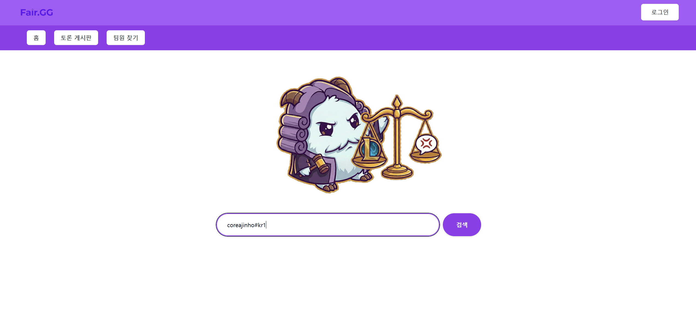
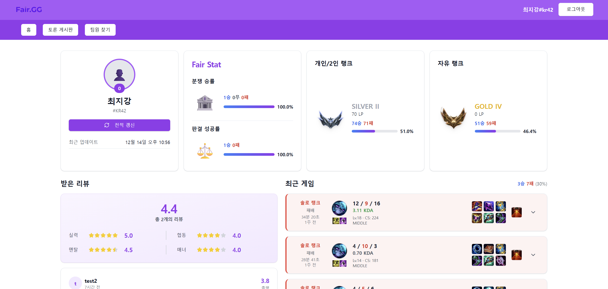
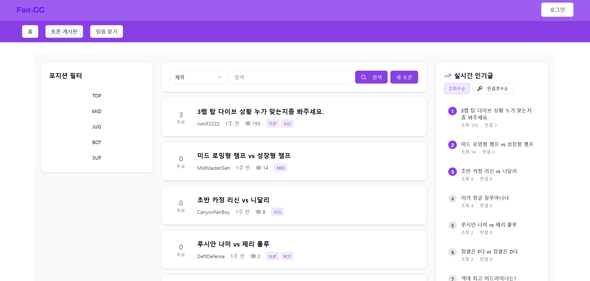
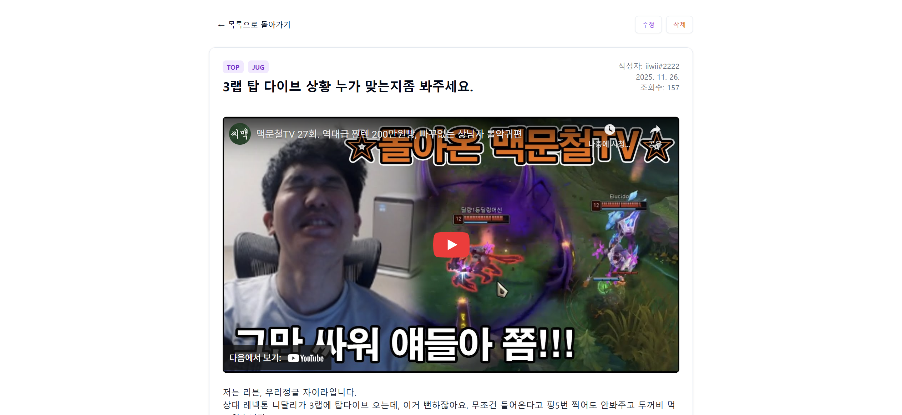
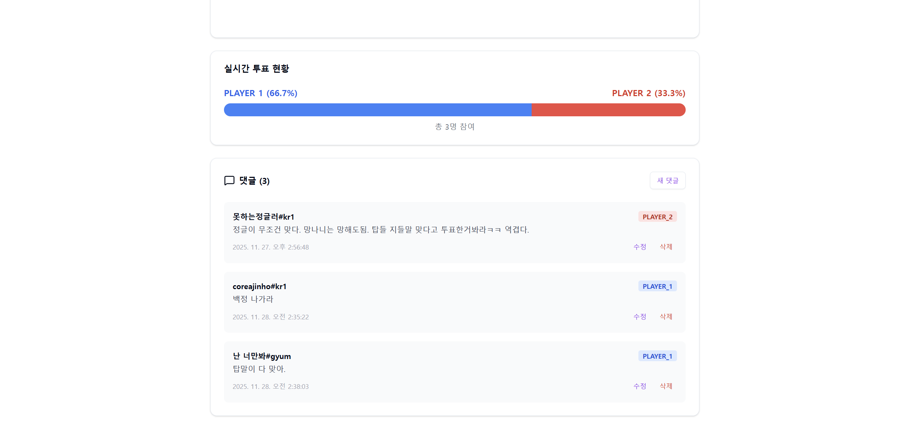
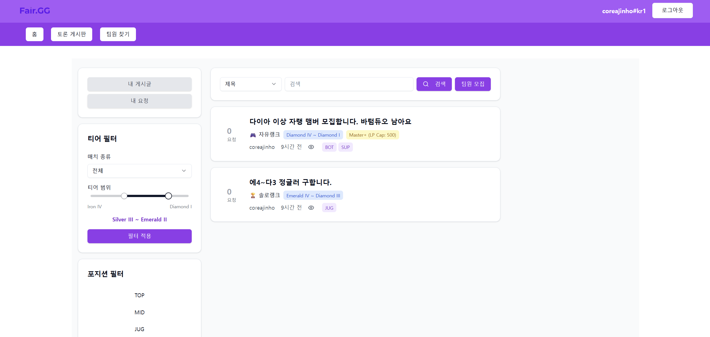
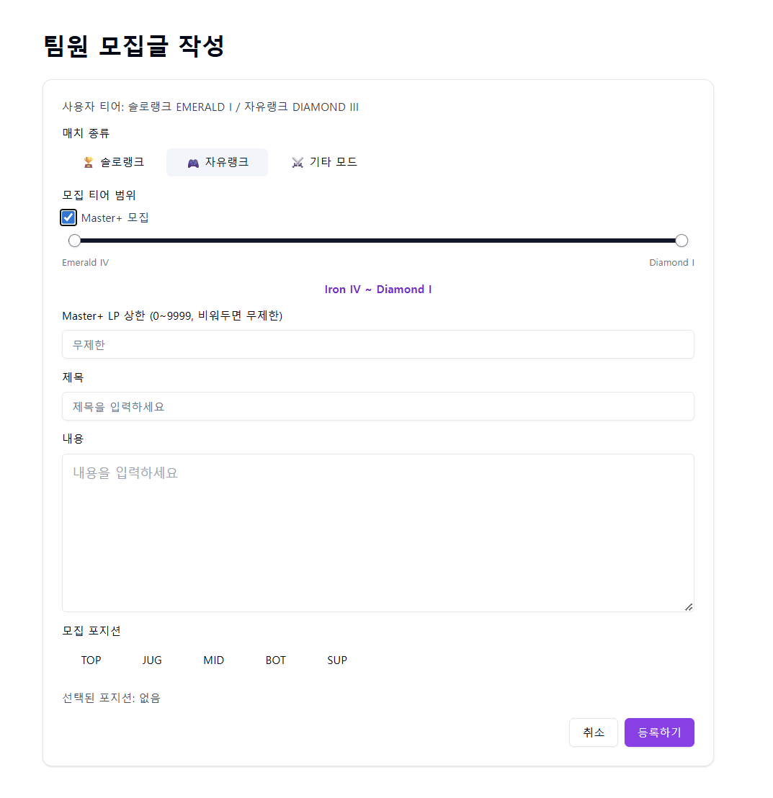
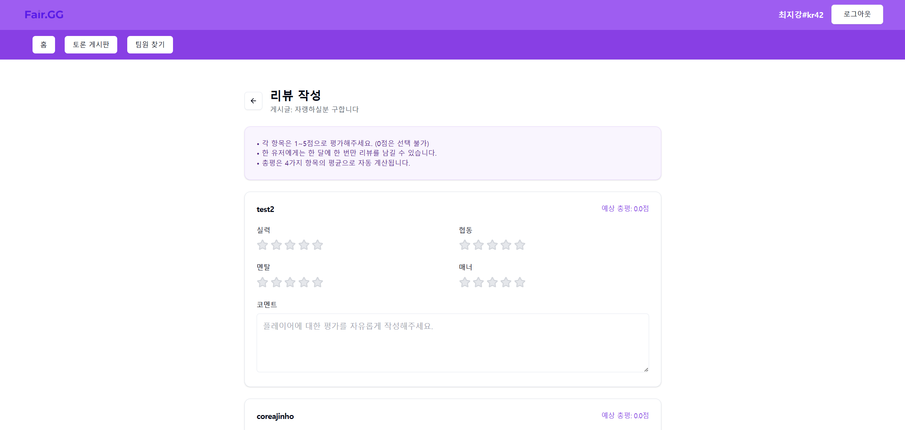

# 🎮 Fair.GG - Backend API Server

## 1. 프로젝트 소개 (Introduction)

**Fair.GG Backend**는 리그 오브 레전드(League of Legends) 소환사 전적 검색 및 커뮤니티 기능을 제공하는 RESTful API 서버입니다.

Riot Games API와 연동하여 실시간 소환사 정보, 매치 히스토리, 랭크 정보를 제공하며, 게임 내 상황에 대한 토론, 팀 찾기, 플레이어 리뷰 등 다양한 커뮤니티 기능을 지원합니다.

### 🎯 핵심 가치
- **실시간 데이터**: Riot API를 통한 최신 소환사 정보 제공
- **커뮤니티 중심**: 토론, 팀 찾기, 리뷰 시스템으로 유저 간 소통 활성화

---

## 2. 접속 방법 (Getting Started)

### 🌐 배포 서버 접속
현재 프로덕션 서버가 배포되어 있습니다. 브라우저에서 아래 주소로 접속하세요.

```
http://54.116.25.208
```

---

## 3. 주요 기능 (Key Features)

### 🔍 소환사 전적 검색 (Summoner 도메인)
Riot API를 활용하여 소환사의 실시간 정보를 제공합니다.

#### 특징
- **기본 전적검색 기능**: 최근 게임 내역, 개인 및 자유랭크 정보 제공 등 기본적인 전적검색 기능 제공
- **Fair Stat**: 토론 게시판 내에서 토론 및 판결을 진행한 결과에 대한 통계 제공
- **리뷰 기능**: 팀원 찾기 게시판 내에서 게시글을 통해 매칭된 사용자들끼리 상호 리뷰를 작성, 개인 페이지에서 해당 계정에 대한 리뷰 통계 확인 가능

| 메인 페이지 (검색) | 소환사 전적 조회 |
| :---: | :---: |
|  |  |

---

### ⚖️ 토론 시스템 (Debate 도메인)
게임 중 발생한 논쟁적인 상황에 대해 커뮤니티의 의견을 수렴하는 투표 기반 토론 플랫폼입니다.

#### 특징
- **영상 기반 토론**: YouTube URL 임베딩으로 객관적 상황 제시
- **진영 투표 로직**: 판결 작성 시 `글작성자` 또는 `분쟁 상대` 진영 선택
- **실시간 집계**: 투표율 계산 및 프로그레스 바 시각화
- **포지션 필터링**: TOP, JUNGLE, MID, ADC, SUPPORT 태그 기반 검색
- **인기 알고리즘**: 조회수 + 댓글 수 기반 트렌딩 게시물 선정
- **상태 관리**: `ACTIVE` → `PENDING` → `EXPIRED` 자동 전환 (스케줄러)
- **토론 연장 시스템**: 토론 시간동안 투표가 동률일 경우 1시간 단위로 토론 자동 연장
- **토론 집계** : 토론 종료 후 토론의 승자와 '옳은 판결'을 낸 유저를 정산하여 유저별 통계로 집계합니다. 이 정보를 팀원 찾기 및 차후 추가 될 가중 투표 기능에 반영할 수 있습니다.


| 토론 게시판 목록 | 토론 상세 (투표 및 댓글) |
| :---: | :---: |
|  |  |

**투표 현황 시각화**



---

### 👥 팀원 찾기 (FindTeam 도메인)
게임을 함께 할 팀원을 모집하는 게시판 기능입니다.

#### 특징
- **매치 타입**: 솔로 랭크, 자유 랭크, 기타 모드 선택 가능
- **포지션 기반 모집**: TOP, JUNGLE, MID, ADC, SUPPORT 포지션별 모집
- **모집자 티어 반영 로직** : 팀원 모집글 작성 시 user의 정보를 자동으로 파악한 뒤, 각 모드마다 티어 제약을 반영하여, 모집글을 작성할 때 티어 범위를 제한합니다.
  매치 모드 선택시, 해당 매치(개인, 자유랭크)에 대한 작성자의 티어 정보를 fetch해서 슬라이더의 범위를 제한하는 방식으로 이루어집니다.
  인게임 티어제약 범위 이내에서는 user자 자유롭게 모집 티어범위를 정할 수 있습니다.
  솔로 랭크(각 티어마다 엄격한 티어제한), 자유 랭크(마스터티어 이상 여부에 따른 티어제한), 기타 모드(티어에 따른 별도의 제한사항이 없는 모드) 선택 가능
- **티어 필터링**: 원하는 티어 범위 설정 (예: GOLD ~ PLATINUM), 모집자가 설정한 범위와, 신청자가 선택한 범위가 겹치는 부분이 있다면, 목록에 표시됩니다.
- **포지션 태그 필터링**: TOP, JUNGLE, MID, ADC, SUPPORT 태그 기반 검색
- **신청차 티어 반영 필터링(미구현)**: 팀원찾기 페이지에 진입 시 user의 티어 정보를 바탕으로, 모집글 목록을 필터링하여, user의 티어에 맞는 모집글만 노출하는 기능
  (현재는 미구현 상태입니다. 현재 필터링 로직은 게임모드, 티어범위를 선택해서 필터링 버튼을 누르면, 해당하는 게임모드(ex 솔로랭크)에 대한 필터링을 해서 프론트앤드로 넘겨주는 방식이었습니다. 
  하지만 (사용자가 게임모드를 선택하기 이전인)팀원찾기 페이지에 진입 하는 시점에 모든 게임 모드에 대한 티어필터 로직을 적용하기 위해서는 기존의 필터링 로직이 아닌,
  조립식으로 전달된 필터 값을 추가해서 여러 모드에 게임을 한번에 필터링하는 기능이 필요합니다. 이를 위해 조립식 필터링 구조가 필요하며, 모든 필터링 로직을 전면 수정해야 합니다, 어떻게 해야할지 찾아보다보니
  12.14일 현재 오늘까지 까지가 제출 마감이기 때문에, 우선 배포를 배포에 시간을 투자하고, 차후에 구현해야 할 것 같습니다.)
- **신청 관리**: 신청 → 수락/거절 워크플로우
- **상태 자동 전환**: 모집글 작성시 `ACTIVE` → 모든 라인 모집 완료시`PENDING`(모두가 매칭을 인지하고 시작할 때까지 대기) → 일정 시간(환경 변수로 관리하며 조정예정입니다) 이후 `MATCHED` 자동 변경 (스케줄러)

- | 팀원 모집 목록 | 팀원 모집글 작성 |
  | :---: | :---: |
  |  |  |

---

### ⭐ 플레이어 리뷰 (Review 도메인)
함께 게임한 플레이어의 플레이 스타일과 매너를 평가하는 리뷰 시스템입니다.

#### 특징
- **월별 제한**: 같은 유저에게 월 1회만 리뷰 작성 가능 (DB Unique Constraint)
- **다양한 평가 항목**: 
  - 실력: 게임 실력 자체를 평가합니다.
  - 멘탈: 게임에서 얼마나 침착하고 긍정적인 태도를 유지했는지 평가합니다.
  - 협동: 팀 플레이와 협력 능력을 평가합니다.
  - 매너: 게임 내 및 팀원들과의 상호작용 과정에서 보여준 태도를 평가합니다.
- **통계 집계**: 각 항목당 평균 별점, 전체 평균 별점을 자동 계산하여 프로필에 표시

- |              팀원 모집 목록               |
  |:-----------------------------------:|
  |  |

---

### 🔐 인증 및 사용자 관리

#### 주요 API
- `POST /api/auth/signup` - 회원가입 (Riot ID 연동)
- `POST /api/auth/login` - 로그인 (JWT 토큰 발급)
- `GET /api/auth/me` - 현재 로그인한 사용자 정보 조회
- `POST /api/auth/validate-cowriter` - CoWriter가 회원인지 검증 (토론 게시글 작성 시)

#### 특징
- **JWT 기반 인증**: Access Token 방식으로 Stateless 인증 구현
- **Spring Security**: BCrypt 암호화, Role 기반 접근 제어
- **Riot ID 연동(라이엇 소셜 로그인 미구현)**: `riotName`#`riotTag` 형식으로 회원가입 시 소환사 정보 자동 연동
  (Riot 소셜 로그인 기능인 RSO를 활용해서 인증 절차를 구현하려고 했지만, RSO 사용을 위해서는 상업용 key가 필요합니다.
  이를 위해서는 웹서비스가 배포된 상태로 Riot측에 신청을 해야합니다. 오늘(12.14) 첫 배포를 마치고 Riot측에 상업용 key 신청을 마친 상태입니다.
  정보를 찾아보니 승인까지의 소요 시간이 빠른경우 3일, 늦으면 2주 가량 걸린다고 합니다.(고지 없이 해주지 않는 경우도 있다고 합니다), 승인이 완료되면 RSO 기능을 추가해야 할 것 같습니다. 
  기간내에 구현하지 못해서 죄송합니다... 현재는 회원가입 시에 riotName#riotTag를 입력받는 방식으로 구현되어 있습니다. 이 후의 정보 수집 과정은 RSO구현 후에도 기존 방식과 동일한 API호출이 유일합니다.
  RSO기능이 구현되면, 별도의 riotName#riotTag 입력 절차 없이 RSO 인증만으로 회원가입이 가능해집니다.)
- **CoWriter 시스템**: 토론 게시글 작성 시 회원가입된 user대상으로 공동 작성자 지정 가능

---

## 4. 기술 스택 (Tech Stack)

### 🛠️ Core Framework


- **Language**: Java 21
- **Framework**: Spring Boot 3.5.6
- **Build Tool**: Gradle 8.x

### 📦 Spring Ecosystem
- **Spring Data JPA**: 엔티티 기반 데이터 접근 계층
- **Spring Security**: JWT 기반 인증/인가
- **Spring WebFlux**: Riot API 비동기 호출 (WebClient)
- **Spring Validation**: `@Valid` 기반 DTO 검증
- **Spring Actuator**: 헬스 체크 및 모니터링

### 🗄️ Database & Migration


- **Database**: MySQL 8.0
- **Connection Pool**: HikariCP

### 🔧 Libraries & Tools
- **Lombok**: 보일러플레이트 코드 제거 (`@Getter`, `@Builder`, `@RequiredArgsConstructor`)
- **MapStruct**: Entity ↔ DTO 자동 매핑
- **JWT**: `io.jsonwebtoken:jjwt-api:0.12.3` - Access Token 생성/검증
- **WebFlux**: Riot API 비동기 병렬 호출 (Mono, Flux)
- **JUnit 5 & Mockito**: 단위/통합 테스트

### 🐳 Infrastructure


- **Containerization**: Docker Compose (MySQL 컨테이너)
- **Deployment**: AWS EC2

---

## 5. 아키텍처 (Architecture)

### 📂 프로젝트 구조
```
st-capstone-backend/
├── src/main/java/org/example/stcapstonebackend/
│   ├── common/                    # 공통 모듈
│   │   ├── advice/                # 전역 예외 처리 (ControllerAdvice)
│   │   ├── client/                # 외부 API 클라이언트 (Riot API)
│   │   ├── config/                # 설정 클래스 (Security, WebClient, CORS)
│   │   ├── exception/             # 커스텀 예외 정의
│   │   ├── model/                 # 공통 도메인 모델 (PositionTag, Tier, Division)
│   │   ├── security/              # JWT 필터, Provider, UserDetails
│   │   └── util/                  # 유틸리티 클래스 (TierCalculator 등)
│   │
│   ├── debate/                    # 토론 도메인
│   │   ├── model/                 # DebatePost, DebateComment 엔티티
│   │   ├── dto/                   # Request/Response DTO
│   │   ├── mapper/                # MapStruct 매퍼
│   │   ├── exception/             # 도메인 예외
│   │   ├── scheduler/             # 토론 상태 자동 전환 스케줄러
│   │   ├── DebatePostController.java
│   │   ├── DebateCommentController.java
│   │   ├── DebatePostService.java
│   │   └── DebatePostRepository.java
│   │
│   ├── findTeam/                  # 팀 찾기 도메인
│   │   ├── model/                 # FindTeamPost, FindTeamRequest 엔티티
│   │   ├── dto/                   # Request/Response DTO
│   │   ├── mapper/                # MapStruct 매퍼
│   │   ├── exception/             # 도메인 예외
│   │   ├── scheduler/             # 모집 상태 자동 전환 스케줄러
│   │   ├── FindTeamPostController.java
│   │   ├── FindTeamRequestController.java
│   │   ├── FindTeamPostService.java
│   │   └── FindTeamPostRepository.java
│   │
│   ├── review/                    # 리뷰 도메인
│   │   ├── model/                 # Review 엔티티
│   │   ├── dto/                   # Request/Response DTO
│   │   ├── mapper/                # MapStruct 매퍼
│   │   ├── exception/             # 도메인 예외
│   │   ├── ReviewController.java
│   │   ├── ReviewService.java
│   │   └── ReviewRepository.java
│   │
│   ├── summoner/                  # 소환사 검색 도메인
│   │   ├── dto/                   # Riot API 응답 DTO
│   │   ├── SummonerController.java
│   │   └── SummonerService.java
│   │
│   └── user/                      # 사용자 및 인증 도메인
│       ├── model/                 # User 엔티티
│       ├── dto/                   # Request/Response DTO
│       ├── exception/             # 도메인 예외
│       ├── AuthController.java
│       ├── UserService.java
│       └── UserRepository.java
│
├── src/main/resources/
│   ├── application.properties             # 메인 설정 파일
│   ├── application-dev.properties         # 개발 환경 설정
│   ├── application-prod.properties        # 프로덕션 환경 설정
│   └── db/migration/                      # Flyway 마이그레이션 SQL
│
└── docker-compose.yml                     # MySQL 컨테이너 설정
```

### 🏗️ 레이어 아키텍처
```
┌─────────────────────────────────────────┐
│  Controller Layer (REST API)            │  ← @RestController, @RequestMapping
├─────────────────────────────────────────┤
│  Service Layer (Business Logic)         │  ← @Service, @Transactional
├─────────────────────────────────────────┤
│  Repository Layer (Data Access)         │  ← JpaRepository, Custom Queries
├─────────────────────────────────────────┤
│  Entity Layer (Domain Model)            │  ← @Entity, Lombok
└─────────────────────────────────────────┘
         ↕
┌─────────────────────────────────────────┐
│  External API (Riot Games)              │  ← WebClient (WebFlux)
└─────────────────────────────────────────┘
```

### 🔒 보안 플로우
```
Client Request
    ↓
1. JwtAuthenticationFilter (JWT 검증)
    ↓
2. SecurityContext에 Authentication 저장
    ↓
3. Controller (@PreAuthorize 또는 Authentication 파라미터)
    ↓
4. Service Layer (비즈니스 로직 처리)
    ↓
Response (200 OK / 401 Unauthorized / 403 Forbidden)
```

---

## 6. 주요 기술적 특징 (Technical Highlights)

### 🚀 성능 최적화
1. **비동기 병렬 처리**: WebFlux `Flux.zip()`을 활용한 Riot API 멀티 매치 동시 조회
   ```java
   // 5개 매치를 병렬로 조회하여 응답 속도 향상
   Flux.fromIterable(matchIds)
       .flatMap(matchId -> getMatch(matchId))
       .collectList();
   ```

2. **N+1 문제 해결**: `@EntityGraph` 및 Fetch Join으로 연관 엔티티 한 번에 로딩

3. **DB 인덱스 최적화**: 자주 조회되는 컬럼(writer, status, positionTags)에 복합 인덱스 적용

### 🛡️ 보안 강화
- **BCrypt 암호화**: 패스워드 단방향 해싱 (Salt 자동 생성)
- **CORS 정책**: 허용된 Origin만 API 접근 가능
- **JWT 만료 관리**: Access Token 24시간 유효 (환경 변수로 조정 가능)
- **@Transactional(readOnly = true)**: 읽기 전용 트랜잭션으로 성능 향상 및 데이터 무결성 보장

### 📊 데이터베이스 설계
- **Unique Constraint**: 월별 리뷰 중복 방지 (`reviewer_id`, `reviewee_id`, `review_year_month`)
- **Soft Delete**: 게시글 삭제 시 `deletedAt` 타임스탬프 기록 (물리 삭제 안 함)
- **Auditing**: `@CreatedDate`, `@LastModifiedDate`로 생성/수정 시간 자동 기록


## 7. 참고 자료 (References)

본 프로젝트는 Riot Games의 지적 재산권 가이드를 준수하며 개발되었습니다.

### 📚 공식 문서
- **Riot Developer Portal**: https://developer.riotgames.com/
- **Riot API Documentation**: https://developer.riotgames.com/apis
  - Account-V1: Riot ID 기반 계정 조회
  - Summoner-V4: 소환사 정보 조회
  - Match-V5: 매치 히스토리 조회
  - League-V4: 랭크 정보 조회
- **Data Dragon**: https://developer.riotgames.com/docs/lol#data-dragon
  - 챔피언 이미지, 아이템 아이콘, 스펠 이미지 등 정적 자산 제공
- **Riot Games Legal Jibber Jabber**: https://www.riotgames.com/en/legal

---


## 8. 기여 및 문의 (Contributing & Contact)

### 🤝 팀원
- **Backend Developer**: 유진호
- **Frontend Developer**: 유진호
- **Designer**: 유진호

### 📧 문의 
프로젝트에 대한 문의사항이 있으시면 아래 이메일로 연락주세요.
- Email: coreajinho123@gmail.com

### 🐛 버그 제보
버그를 발견하셨다면 GitHub Issues에 등록해주세요.

---

<div align="center">

**⚡ Powered by Riot Games API**

</div>

